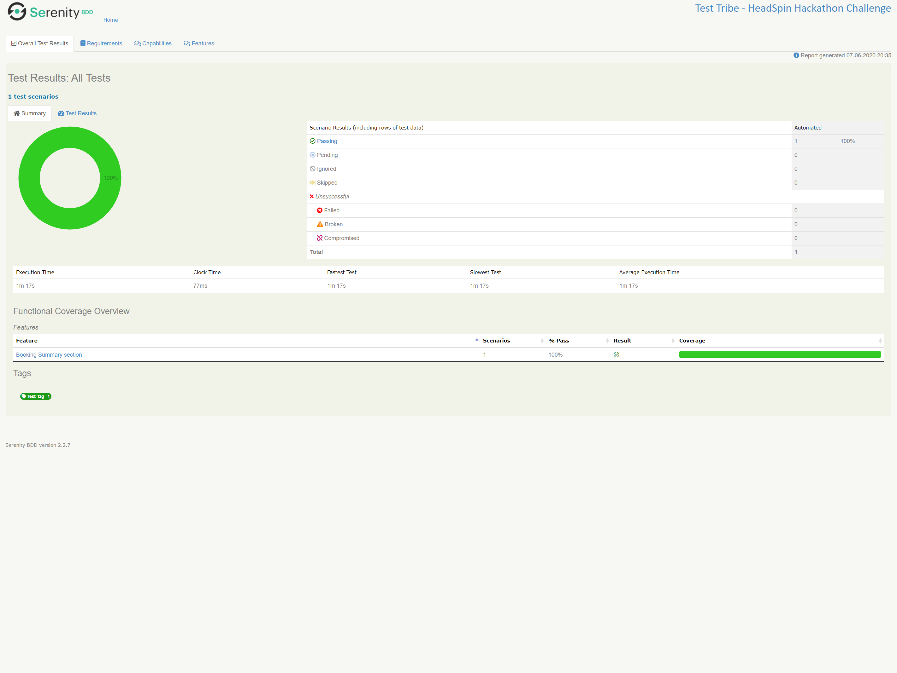

## MMT Automation - HeadSpin Hackathon

Web Automation Testing for Hotel Booking flow for Make My Trip site.

### Pre-requisites

- [Java 8](https://jdk.java.net/8/)
- [Maven](https://maven.apache.org/download.cgi)
- Cucumber 
- Serenity


### Project Structure
The main directories / files in the project are as below:
- test: The directory for all tests
- business_layer: All directories in test are abstracted based on business flows
- resources: It consist of feature files written in BDD format and have browser drivers
- utils: Directory that contains helper classes like Constants, Helper methods.


### User Journey that is Automated
-Refer resource/features/booking/booking_summary.feature

### Run Test
Tests can be run on locally based on tags hooked in features.

Run tests locally:
```$xslt
mvn clean verify "-Dcucumber.options=--tags @BookingSummaryTest"
```

### Reports
Serenity reports are generated after tests run:  

